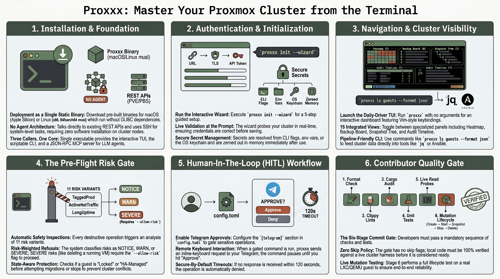

<p align="center">
  
</p>

<h1 align="center">proxxx</h1>

<p align="center">
  <strong>Terminal cockpit for Proxmox VE & Proxmox Backup Server.</strong>
</p>

<p align="center">
  Rust · async · single static binary · no installer · no agent.<br>
  Talks to the things that already exist on your cluster — REST against PVE and PBS, SSH for the rest — instead of asking you to deploy a new daemon.
</p>

<p align="center">
  <a href="https://github.com/fabriziosalmi/proxxx/actions/workflows/ci.yml"></a>
  <a href="#license"></a>
</p>

<p align="center">
  
</p>

---

## Who is this for?

Pick the row that matches you and jump straight to the right page.

| If you are… | …you'll care about | Start here |
| :--- | :--- | :--- |
| **Homelab solo** running 1-3 nodes | wizard, fast TUI, single binary, no daemons | [5-min homelab quickstart](https://fabriziosalmi.github.io/proxxx/guide/quickstart-homelab) |
| **Platform / SRE** on 10-50 nodes with on-call | HITL Telegram gate, alert daemon, `--format json` for CI, `--profile` for multi-cluster | [Production checklist](https://fabriziosalmi.github.io/proxxx/guide/production-checklist) · [HITL](https://fabriziosalmi.github.io/proxxx/integrations/hitl) |
| **DevOps** scripting Proxmox in pipelines | typed exit codes, deterministic JSON, pre-flight risk gate, batch ops with `--yes` | [CLI reference](https://fabriziosalmi.github.io/proxxx/reference/cli) · [Exit codes](https://fabriziosalmi.github.io/proxxx/reference/exit-codes) |
| **LLM / agent integrator** wiring Claude/Cursor to a cluster | MCP stdio server, compile-time-fixed 10-tool registry, SHA-256 pinned for supply-chain audit | [LLM/MCP quickstart](https://fabriziosalmi.github.io/proxxx/guide/quickstart-llm-mcp) |
| **Security / compliance** evaluating before deploy | typed errors, HITL replay protection, sigstore-signed releases, CycloneDX SBOM, gate on every commit | [Production checklist](https://fabriziosalmi.github.io/proxxx/guide/production-checklist) · [`SECURITY.md`](SECURITY.md) |
| **Contributor** sending a PR | 7-stage commit gate (live cluster + mutation lifecycle), no-skip-flags policy | [`CONTRIBUTING.md`](CONTRIBUTING.md) · [Pre-commit gate](https://fabriziosalmi.github.io/proxxx/guide/pre-commit-gate) |

---

## What you get

- **One binary** — `proxxx`. CLI, TUI, MCP server, alert daemon, HITL daemon all in the same executable.
- **Cluster-wide read in a second** — `proxxx ls nodes`, `proxxx ls guests`, fuzzy search across the whole cluster from `/`.
- **Pipeline writes** — start, stop, migrate, snapshot, clone, backup, patch, disk-move, with `--format json` for jq.
- **Pre-flight risk gate** — 11 risk variants (`Locked`, `Running`, `LongUptime`, `TaggedProd`, `ActiveNetTraffic`, `HaManaged`, …) refuse destructive ops on running guests without `--allow-risk`.
- **HITL** — Telegram-mediated human approval gate, deny-on-timeout (120 s), policy-driven by tag / vmid / wildcard.
- **Console handoff** — SSH (system `ssh` + QGA / lxc-interfaces auto-discovery), serial (termproxy WebSocket), SPICE (`.vv` 0600), noVNC (system browser) — all from `proxxx <verb> <vmid>`.
- **PBS browse + restore** — REST browse plus `proxmox-backup-client` restore with `kill_on_drop` supervision.
- **MCP server** — stdio JSON-RPC for LLM agents, compile-time-fixed tool registry, surface SHA-256 pinned.
- **Verifiable releases** — every tarball ships with three layers: SHA-256 sidecar, sigstore keyless cosign signature pinned to this exact workflow path (offline-verifiable; transparency-log inclusion proof embedded), and a CycloneDX SBOM generated from `Cargo.lock`. Audit with `cosign verify-blob` + `grype` / `trivy`.

## Install

Pre-built binaries for **macOS Apple Silicon** and **Linux x86_64-musl** are attached to each [tagged release](https://github.com/fabriziosalmi/proxxx/releases). ARM64 Linux builds from source (cross-link toolchain bug; tracked).

Download + verify the full supply-chain trio:

```bash
TARGET=x86_64-unknown-linux-musl     # or aarch64-apple-darwin
VERSION=0.1.7                        # latest at time of writing

gh release download v${VERSION} --repo fabriziosalmi/proxxx \
  --pattern "*-${TARGET}.tar.gz" \
  --pattern "*-${TARGET}.tar.gz.sha256" \
  --pattern "*-${TARGET}.tar.gz.cosign.bundle"

# 1. Checksum
shasum -a 256 -c proxxx-${VERSION}-${TARGET}.tar.gz.sha256

# 2. Sigstore keyless signature (offline; cert pinned to release.yml)
cosign verify-blob \
  --bundle proxxx-${VERSION}-${TARGET}.tar.gz.cosign.bundle \
  --certificate-identity-regexp 'https://github.com/fabriziosalmi/proxxx/.github/workflows/release.yml@.*' \
  --certificate-oidc-issuer 'https://token.actions.githubusercontent.com' \
  proxxx-${VERSION}-${TARGET}.tar.gz

# 3. (optional) Audit the CycloneDX SBOM
gh release download v${VERSION} --repo fabriziosalmi/proxxx \
  --pattern "*.cdx.json" --pattern "*.cdx.json.sha256"
shasum -a 256 -c proxxx-${VERSION}.cdx.json.sha256
grype sbom:proxxx-${VERSION}.cdx.json   # or trivy / cyclonedx-cli

tar xzf proxxx-${VERSION}-${TARGET}.tar.gz
./proxxx-${VERSION}-${TARGET}/proxxx --version
```

If you only want the binary fast (no verification), skip steps 2–3 and run just `shasum -a 256 -c …` from the snippet above. Production deployments should run all three — see the [Production checklist](https://fabriziosalmi.github.io/proxxx/guide/production-checklist).

Or build from source (needs Rust 1.95+):

```bash
git clone https://github.com/fabriziosalmi/proxxx.git
cd proxxx && cargo build --release
./target/release/proxxx --version
```

The Linux musl artifact is statically linked — runs on every distro from RHEL 6 to Alpine 3.x without GLIBC drama.

## Quick start

```bash
proxxx init --interactive               # 5-step wizard: prompts for URL, auth, TLS, optional
                                        # SSH + Telegram, validates each input against the
                                        # live cluster before write. Recommended for first
                                        # run — wrong field caught here, never lands in TOML.
proxxx init                             # non-interactive variant: writes a commented
                                        # starter config.toml; refuses to overwrite — pass
                                        # --force if you mean it. Edit url / user /
                                        # token_id / token_secret manually after.
proxxx ls nodes                         # validates the connection.
proxxx                                  # TUI (no args). Press ? for the keymap; the
                                        # bottom-row footer shows contextual binds always.
proxxx --help                           # full subcommand list.
proxxx version --json                   # build + capability metadata.
```

The starter `config.toml` carries inline comments for every secret-resolution path (CLI flag → env var → 0600 file → OS keychain). Optional sections — HITL via Telegram, SSH layer, PBS, alerts, policies — are commented out so the API-only operator doesn't have to delete anything.

## Daily-driver TUI

Run with no arguments. Vim keys, fuzzy search across the cluster (`/`), command palette (`:`), quick-open palette (`Ctrl+K`). 18 views over the same Elm-pattern reducer:

| `1` Dashboard | `2` Nodes | `3` Guests | `4` Storage |
| :---: | :---: | :---: | :---: |
| `H` Heatmap | `B` Backup board | `G` Config grep | `Q` Operation queue |
| `T` Audit timeline | `Z` Snapshot tree | `D` Drift compare | `W` Hardware passthrough |

Multi-select + bulk ops with pre-flight risk preview. Operation queue with dry-run, diff preview, replay-as-script export (proxxx CLI / pvesh / curl / Ansible), and HITL approval gate (Telegram, policy-driven).

The terminal is restored on every exit path — happy, `?` early-return, panic. RAII `TerminalGuard` plus a flight-recorder panic hook installed in `main()` before the runtime starts.

## Pipeline-friendly CLI

```bash
# Read
proxxx ls guests --format json | jq '.[] | select(.status == "running") | .vmid'
proxxx ha preview --node pve1                   # failover what-if
proxxx hw conflicts --node pve1                 # PCI passthrough audit
proxxx perms root@pam --node pve1               # effective permissions
```

```bash
# Write — every destructive op routes through the pre-flight risk gate
proxxx start 100 101 102
proxxx delete 100 --yes
proxxx migrate 100 pve2 --yes
proxxx snapshot create 100 --name pre-upgrade
proxxx disk move 100 --disk scsi0 --storage ceph-rbd --yes
proxxx patch apply --reboot=auto --dry-run
```

```bash
# Console handoff
proxxx ssh    100                               # interactive ssh into guest (system ssh +
                                                # QGA / lxc-interfaces auto-discovery; falls
                                                # back to [ssh.guests."100"] when explicit)
proxxx serial 100 --node pve1                   # raw termproxy WebSocket
proxxx spice  100 --node pve1                   # writes 0600 .vv, launches remote-viewer
proxxx novnc  100 --node pve1                   # opens browser to web UI's noVNC
```

```bash
# Long-running daemons
proxxx alerts watch --interval 30               # rule-driven alert daemon
proxxx hitl   serve                             # Telegram approval daemon
proxxx mcp    serve                             # stdio JSON-RPC for LLM agents
proxxx mcp    tools --checksum                  # registry SHA-256 for audit pinning
```

Exit codes are stable contract: `0` success, `1` runtime error, `2` argument / config error, `3` HITL denied, `4` precondition refused (running guest, missing config, etc.).

## Configuration

Default location follows the `directories` project-dirs convention:

| Platform | Path |
| :--- | :--- |
| Linux | `~/.config/proxxx/config.toml` |
| macOS | `~/Library/Application Support/dev.proxxx.proxxx/config.toml` |

Secrets resolve in order: CLI flag → `PROXXX_TOKEN_SECRET` env → `token_secret_file` (0600 enforced) → inline TOML → OS keychain. Loaded values live in `Zeroizing<String>` and are wiped from the heap on `Drop`.

| Optional section | Unlocks |
| :--- | :--- |
| `[telegram]`     | HITL approvals + alert routing |
| `[ssh]`          | Patching orchestrator, `proxxx perms`, guest SSH |
| `[ssh.guests.X]` | Per-guest SSH overrides (optional — `proxxx ssh <vmid>` auto-discovers via QGA / lxc-interfaces by default; pin only when the agent's off, only loopback/link-local IPs are returned, or you want a stable DNS name) |
| `[pbs]`          | PBS browse + restore |
| `[[alerts]]`     | Alerting daemon — `node_offline`, `storage_above`, `replication_failing` |
| `[[policies]]`   | HITL gating rules — match by tag / vmid / wildcard |

## Quality gate

Six stages, run as both a pre-commit hook and the CI contract in [`.github/workflows/ci.yml`](.github/workflows/ci.yml).

| Stage | What | Time |
| :---: | :--- | :---: |
| 1 | `cargo fmt --all -- --check` | ~3 s |
| 2 | `cargo clippy --release --all-targets` | 10–60 s |
| 3 | `cargo audit --deny warnings` | 3–5 s |
| 4 | `cargo test --release --all-targets` | 10–90 s |
| 5 | `tests/live/test_run.sh` (88 read-only probes against the live cluster) | ~30 s |
| 6 | `tests/live/test_mutation.sh` (LXC + cluster-level CRUD + QEMU; opt-in QGA via `PROXXX_E2E_QGA_VMID=<vmid>`) | ~60 s |

```bash
git config core.hooksPath .githooks
chmod +x scripts/gate.sh .githooks/pre-commit .githooks/pre-push
cargo install cargo-audit --locked
```

The clippy `[lints.clippy]` block in [`Cargo.toml`](Cargo.toml) denies `unwrap_used`, `expect_used`, `panic`, `todo`, `await_holding_lock` in production code.

## Architecture

Pure Elm-pattern TUI over a typed REST client. The reducer is sync, total, and tested without a runtime.

```
        crossterm key            tokio::mpsc<DataMsg>
  user ─────────────────► event::map_key ─► Action
                                              │
                                              ▼
                                   app::update(state, action)
                                              │
                                ┌─────────────┴────────────┐
                                ▼                          ▼
                          AppState mutation      Option<SideEffect>
                                                          │
                                                          ▼
                                       enforce_preflight  →  check_hitl
                                       (risk gate)           (Telegram round-trip)
                                                          │
                                                          ▼
                                       ProxmoxGateway / PbsGateway / SshPool
```

| Module | Responsibility |
| :--- | :--- |
| [`src/app.rs`](src/app.rs) | Pure reducer. No I/O, no async. ~70 `Action` variants, ~20 `SideEffect`. |
| [`src/api/`](src/api) | `ProxmoxGateway` trait, typed `ApiError` enum (8 categorical variants), reqwest client with 32 MiB body cap and rate limiter. |
| [`src/api/error.rs`](src/api/error.rs) | `Unauthorized`, `Forbidden`, `NotFound`, `RateLimited`, `PayloadTooLarge`, `StorageHang`, `Transport`, `Schema`. Callers `.downcast_ref()` for differentiated handling. |
| [`src/pbs/`](src/pbs) | PBS REST browse + `kill_on_drop(true)` supervision over `proxmox-backup-client restore`. |
| [`src/ssh/`](src/ssh) | `russh`, publickey only, dedicated TOFU `known_hosts` (separate from `~/.ssh/`), per-node connection pool. |
| [`src/app/cache.rs`](src/app/cache.rs) | SQLite-backed time-travel cache, drives `proxxx replay <timestamp>`. |
| [`src/app/preflight.rs`](src/app/preflight.rs) | 11 risk variants with per-op weighting and `--allow-risk` override. |
| [`src/hitl/`](src/hitl) | Real Telegram round-trip via `HitlCoordinator` + a single shared `getUpdates` poller. Deny on 120 s timeout, deny when Telegram unconfigured but a policy matched. |
| [`src/mcp/`](src/mcp) | Stdio JSON-RPC server. Compile-time-fixed tool registry (10 tools). Surface SHA-256 pinned via `proxxx mcp tools --checksum`. |
| [`src/util/`](src/util) | `panic_hook` (flight recorder), `terminal_guard` (RAII raw-mode), `shutdown` (SIGTERM / SIGINT for daemons). |

## Documentation

- **VitePress site** — [`docs/`](docs/) and [the live build](https://fabriziosalmi.github.io/proxxx/). Local preview: `cd docs && npm install && npx vitepress dev`.
- [`CHANGELOG.md`](CHANGELOG.md) — what shipped, with the SemVer contract for CLI / JSON / config / MCP registry surfaces.
- [`pre-commit/`](pre-commit/) — four matrices distinguishing *implemented* from *verified end-to-end*:
    [`01-feature-coverage.md`](pre-commit/01-feature-coverage.md) ·
    [`02-error-handling.md`](pre-commit/02-error-handling.md) ·
    [`03-security-invariants.md`](pre-commit/03-security-invariants.md) ·
    [`04-resiliency-and-chaos.md`](pre-commit/04-resiliency-and-chaos.md)
- [`SECURITY.md`](SECURITY.md) — vulnerability reporting policy + scope + hardening snapshot.
- [`CONTRIBUTING.md`](CONTRIBUTING.md) — onboarding, the gate, live-cluster verification format.
- [`.cargo/audit.toml`](.cargo/audit.toml) — supply-chain advisory ignore policy.

## Live cluster harness

[`tests/live/`](tests/live/) drives the release binary against a real PVE cluster — separate from the cargo integration tests in [`tests/`](tests/) which use `wiremock`.

| File | Tracked | Purpose |
| :--- | :---: | :--- |
| [`test_run.sh`](tests/live/test_run.sh) | ✓ | 88 read-only probes covering the full CLI surface; logs to `test_run.log` |
| [`test_mutation.sh`](tests/live/test_mutation.sh) | ✓ | Full mutation lifecycle with `trap EXIT` cleanup: LXC 9999 (create → start → snapshot → stop → delete), cluster-level CRUD (pool / firewall-cluster alias+group+ipset / backup-job / notifications endpoint+matcher / storage-defs), QEMU 9998 from alpine ISO, opt-in QGA round-trips via `PROXXX_E2E_QGA_VMID=<vmid>` |
| `test_*.log` | — | Generated by the harness |

## Honest non-goals

Design boundaries — proxxx will not ship these.

- **No GUI.** Proxmox already has a web UI; proxxx is for terminal users who want CLI / TUI / scripting parity.
- **No frame rendering** for graphical SPICE or VNC. proxxx hands off to `remote-viewer` / `virt-viewer` (SPICE) or the system browser (noVNC). It never holds pixel buffers.
- **No re-implementation of Perl algorithms in Rust** where the Perl on the node is the ground truth. `proxxx perms` shells out to `pveum user permissions` over SSH and parses, since the `pve-access-control` evaluator is canonical. The API-side `proxxx access permissions` is also available — same typed tree from `/access/permissions`, no SSH dependency — for the common case where the evaluator's full expansion isn't needed.
- **No new dependencies for trivial things.** Three-line per-platform `Command::new` beats pulling `opener` for a launcher.
- **No multi-cluster aggregation in the TUI** — single profile per process by architectural decision; switch with `--profile`.
- **No Ceph cluster writes.** Operators reach for the `ceph` CLI directly on the node where the kernel module is loaded; proxxx wraps Ceph reads (status, metadata, flags) but not destructive ops (osd add/down, mon create, pool prune).
- **No SDN config writes.** PVE SDN is opt-in cluster config that few clusters enable, and the wire shape changes between PVE versions. Skipped rather than ship a fragile surface.
- **No browser-only auth flows.** U2F/WebAuthn registration and OIDC's redirect-callback dance both need a browser to drive them. proxxx exposes the API-driven primitives (token CRUD, password change, ACL editing) but stays out of `/access/openid/*` and `/access/tfa/u2f` — there's no terminal UX for those that beats the web UI.
- **No snapshot rollback as a destructive trigger.** The snapshot-tree TUI shows a read-only rollback impact preview (what would be discarded + time delta); the actual rollback runs through `qm rollback` / `pct rollback` or the PVE web UI. Read-only inspector views never expose destructive entry points by design.

## License

MIT. Copyright © 2026 Fabrizio Salmi. See [`LICENSE`](LICENSE).
