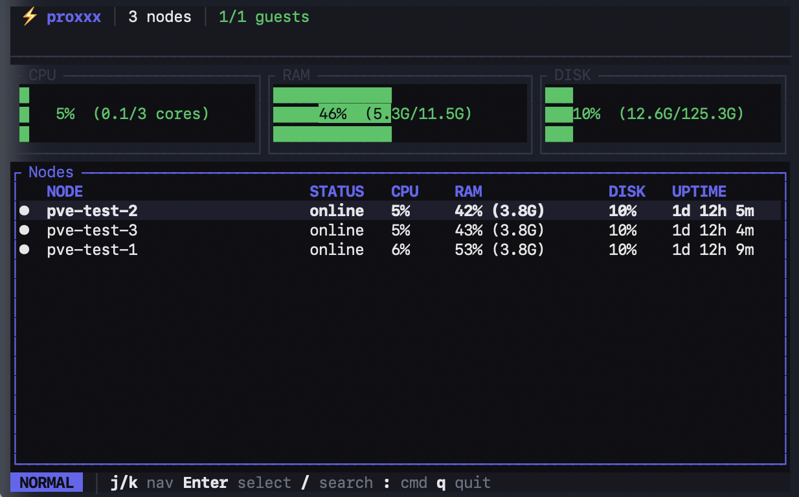

<p align="center">
  
</p>

<h1 align="center">proxxx</h1>

<p align="center">
  <strong>Terminal cockpit for Proxmox VE &amp; Proxmox Backup Server.</strong>
</p>

<p align="center">
  Rust · async · single static binary · no installer · no agent.<br>
  Talks to the things that already exist on your cluster — REST against PVE and PBS, SSH for the rest — instead of asking you to deploy a new daemon.
</p>

<p align="center">
  <a href="https://github.com/fabriziosalmi/proxxx/actions/workflows/ci.yml"></a>
  <a href="#license"></a>
  <a href="#quality-gate"></a>
  <a href="https://github.com/fabriziosalmi/proxxx/releases"></a>
</p>

<p align="center">
  
</p>

---

Every commit is gated locally and in CI against `cargo fmt`, `cargo clippy --all-targets`, `cargo audit --deny warnings`, the full test suite, **88 read-only probes against a live test cluster**, and a full mutation lifecycle (LXC 9999 + cluster-level CRUD across pool / firewall-cluster / backup-jobs / notifications / storage-defs + QEMU 9998 from an alpine ISO + opt-in QGA agent-required round-trips). For live counts of CLI subcommands and audit ignores, run `proxxx version --json` — the binary is the source of truth.

## Install

```bash
git clone https://github.com/fabriziosalmi/proxxx.git
cd proxxx && cargo build --release
./target/release/proxxx --version
```

The release binary is ~6–8 MB stripped on `aarch64-darwin` / `x86_64-linux`. Static musl artefact (`x86_64-unknown-linux-musl`) is built by CI and runs on any Linux distribution from RHEL 6 to Alpine 3.

## Quick start

```bash
proxxx init                             # writes a starter config.toml to the OS-default
                                        # config dir (e.g. ~/.config/proxxx/config.toml on
                                        # Linux); refuses to overwrite — pass --force if
                                        # you mean it. Edit `url`, `user`, `token_id`,
                                        # `token_secret` and you're ready.
proxxx ls nodes                         # validates the connection. Any subcommand works
                                        # the same way; --format json for pipelines.
proxxx                                  # TUI (no args). Press ? for the keymap.
proxxx --help                           # full subcommand list (65 today)
proxxx version --json                   # build + capability metadata
```

The starter `config.toml` from `proxxx init` carries inline comments
for every secret-resolution path (CLI flag → env var → 0600 file →
OS keychain), the optional HITL / SSH / PBS / alerts sections all
commented out so an operator who only wants the API client doesn't
have to delete anything.

## Daily-driver TUI

Run with no arguments. Vim keys, fuzzy search across the cluster (`/`), command palette (`:`), quick-open palette (`Ctrl+K`). 18 views over the same Elm-pattern reducer:

| `1` Dashboard | `2` Nodes | `3` Guests | `4` Storage |
| :---: | :---: | :---: | :---: |
| `H` Heatmap | `B` Backup board | `G` Config grep | `Q` Operation queue |
| `T` Audit timeline | `Z` Snapshot tree | `D` Drift compare | `W` Hardware passthrough |

Multi-select + bulk ops with pre-flight risk preview. Operation queue with dry-run, diff preview, replay-as-script export (proxxx CLI / pvesh / curl / Ansible), and HITL approval gate (Telegram, policy-driven).

The terminal is restored on every exit path — happy, `?` early-return, panic. RAII `TerminalGuard` plus a flight-recorder panic hook installed in `main()` before the runtime starts.

## Pipeline-friendly CLI

```bash
# Read
proxxx ls guests --format json | jq '.[] | select(.status == "running") | .vmid'
proxxx ha preview --node pve1                   # failover what-if
proxxx hw conflicts --node pve1                 # PCI passthrough audit
proxxx perms root@pam --node pve1               # effective permissions

# Write — every destructive op routes through the pre-flight risk gate
proxxx start 100 101 102
proxxx delete 100 --yes
proxxx migrate 100 --target pve2 --yes
proxxx snapshot create 100 --name pre-upgrade
proxxx disk move 100 --disk scsi0 --storage ceph-rbd --yes
proxxx patch apply --reboot=auto --dry-run

# Console handoff
proxxx ssh    100                               # russh PTY (per-guest config)
proxxx serial 100 --node pve1                   # raw termproxy WebSocket
proxxx spice  100 --node pve1                   # writes 0600 .vv, launches remote-viewer
proxxx novnc  100 --node pve1                   # opens browser to web UI's noVNC

# PBS browse + restore
proxxx pbs snapshots --store main --backup-type vm --backup-id 100
proxxx pbs restore   --store main --snapshot ... --target /tmp/...

# Long-running daemons
proxxx alerts watch --interval 30               # rule-driven alert daemon
proxxx hitl   serve                             # Telegram approval daemon
proxxx mcp    serve                             # stdio JSON-RPC for LLM agents
proxxx mcp    tools --checksum                  # registry SHA-256 for audit pinning
```

Exit codes are stable contract: `0` success, `1` runtime error, `2` argument / config error, `3` HITL denied, `4` precondition refused (running guest, missing config, etc.).

## Quality gate

Six stages, run both as a pre-commit hook and as the CI contract in [`.github/workflows/ci.yml`](.github/workflows/ci.yml). No skip flags. The only way past is `git commit --no-verify`, and the committer owns the consequence.

| Stage | What | Time |
| :---: | :--- | :---: |
| 1 | `cargo fmt --all -- --check` | ~3 s |
| 2 | `cargo clippy --release --all-targets` | 10–60 s |
| 3 | `cargo audit --deny warnings` | 3–5 s |
| 4 | `cargo test --release --all-targets` | 10–90 s |
| 5 | `tests/live/test_run.sh` (88 read-only probes against the live cluster) | ~30 s |
| 6 | `tests/live/test_mutation.sh` (LXC 9999 lifecycle + cluster-level CRUD + QEMU 9998; opt-in QGA round-trips via `PROXXX_E2E_QGA_VMID=<vmid>`) | ~60 s |

```bash
git config core.hooksPath .githooks
chmod +x scripts/gate.sh .githooks/pre-commit .githooks/pre-push
cargo install cargo-audit --locked
```

`pre-commit` and `pre-push` both call [`scripts/gate.sh`](scripts/gate.sh) — bypassing one is caught by the other. The clippy `[lints.clippy]` block in [`Cargo.toml`](Cargo.toml) denies `unwrap_used`, `expect_used`, `panic`, `todo`, `await_holding_lock` in production code.

## Configuration

Default location follows the `directories` project-dirs convention:

| Platform | Path |
| :--- | :--- |
| Linux   | `~/.config/proxxx/config.toml` |
| macOS   | `~/Library/Application Support/dev.proxxx.proxxx/config.toml` |
| Windows | `%APPDATA%\dev\proxxx\proxxx\config.toml` |

Secrets resolve in order: CLI flag → `PROXXX_TOKEN_SECRET` env → `token_secret_file` → inline TOML → OS keychain. Loaded values live in `Zeroizing<String>` and are wiped from the heap on `Drop`.

| Optional section | Unlocks |
| :--- | :--- |
| `[telegram]`     | HITL approvals + alert routing |
| `[ssh]`          | Patching orchestrator, `proxxx perms`, guest SSH |
| `[ssh.guests.X]` | Per-guest SSH session targets |
| `[pbs]`          | PBS browse + restore (PBS uses `:` not `=` in the auth header) |
| `[[alerts]]`     | Alerting daemon — `node_offline`, `storage_above`, `replication_failing` |
| `[[policies]]`   | HITL gating rules — match by tag / vmid / wildcard |

A starter `config.toml` with every section commented and inline secret-resolution docs is generated by `proxxx init`.

## Architecture

Pure Elm-pattern TUI over a typed REST client. The reducer is sync, total, and tested without a runtime.

```
        crossterm key            tokio::mpsc<DataMsg>
  user ─────────────────► event::map_key ─► Action
                                              │
                                              ▼
                                   app::update(state, action)
                                              │
                                ┌─────────────┴────────────┐
                                ▼                          ▼
                          AppState mutation      Option<SideEffect>
                                                          │
                                                          ▼
                                       enforce_preflight  →  check_hitl
                                       (risk gate)           (Telegram round-trip)
                                                          │
                                                          ▼
                                       ProxmoxGateway / PbsGateway / SshPool
```

| Module | Responsibility |
| :--- | :--- |
| [`src/app.rs`](src/app.rs) | Pure reducer. No I/O, no async. ~80 `Action` variants, ~30 `SideEffect`. |
| [`src/api/`](src/api) | `ProxmoxGateway` trait, typed `ApiError` enum (8 categorical variants), reqwest client with 32 MiB body cap and rate limiter. |
| [`src/api/error.rs`](src/api/error.rs) | `Unauthorized`, `Forbidden`, `NotFound`, `RateLimited`, `PayloadTooLarge`, `StorageHang`, `Transport`, `Schema`. Callers `.downcast_ref()` for differentiated handling. |
| [`src/pbs/`](src/pbs) | PBS REST browse + `kill_on_drop(true)` supervision over `proxmox-backup-client restore`. |
| [`src/ssh/`](src/ssh) | `russh`, publickey only, dedicated TOFU `known_hosts` (separate from `~/.ssh/`), per-node connection pool. |
| [`src/app/cache.rs`](src/app/cache.rs) | SQLite-backed time-travel cache, drives `proxxx replay <timestamp>`. |
| [`src/app/preflight.rs`](src/app/preflight.rs) | 11 risk variants (`Locked`, `Running`, `LongUptime`, `TaggedProd`, `ActiveNetTraffic`, `HaManaged`, …) with per-op weighting and `--allow-risk` override. |
| [`src/hitl/`](src/hitl) | Real Telegram round-trip via `HitlCoordinator` + a single shared `getUpdates` poller. Deny on 120 s timeout, deny when Telegram unconfigured but a policy matched. |
| [`src/mcp/`](src/mcp) | Stdio JSON-RPC server. Compile-time-fixed tool registry (10 tools). Surface SHA-256 pinned via `proxxx mcp tools --checksum`. |
| [`src/util/`](src/util) | `panic_hook` (flight recorder), `terminal_guard` (RAII raw-mode), `shutdown` (SIGTERM / SIGINT for daemons). |

## Documentation

- **VitePress site** — [`docs/`](docs/) and [the live build](https://fabriziosalmi.github.io/proxxx/). The site covers guide, reference, integrations, architecture. Local preview: `cd docs && npm install && npx vitepress dev`.
- [`CHANGELOG.md`](CHANGELOG.md) — what shipped, with the SemVer contract for CLI / JSON / config / MCP registry surfaces.
- [`pre-commit/`](pre-commit/) — four matrices distinguishing *implemented* from *verified end-to-end*:
    [`01-feature-coverage.md`](pre-commit/01-feature-coverage.md) ·
    [`02-error-handling.md`](pre-commit/02-error-handling.md) ·
    [`03-security-invariants.md`](pre-commit/03-security-invariants.md) ·
    [`04-resiliency-and-chaos.md`](pre-commit/04-resiliency-and-chaos.md)
- [`SECURITY.md`](SECURITY.md) — vulnerability reporting policy + scope + hardening snapshot.
- [`.cargo/audit.toml`](.cargo/audit.toml) — supply-chain advisory ignore policy. Every entry must include the crate + version, dependency path, threat-model justification, and remediation. Entries without remediation are debt, not policy.
- [`assets/`](assets/) — brand assets ([`build.py`](assets/build.py) regenerates all icon variants from [`proxxx.png`](proxxx.png)).

## Live cluster harness

[`tests/live/`](tests/live/) drives the release binary against a real PVE cluster — separate from the cargo integration tests in [`tests/`](tests/) which use `wiremock`.

| File | Tracked | Purpose |
| :--- | :---: | :--- |
| [`test_run.sh`](tests/live/test_run.sh) | ✓ | 88 read-only probes against the live cluster (covers all 65 CLI subcommands across the 2026-05-04 PVE API expansion); logs to `test_run.log` |
| [`test_mutation.sh`](tests/live/test_mutation.sh) | ✓ | Full mutation lifecycle with `trap EXIT` cleanup: LXC 9999 (create → start → snapshot → stop → delete), cluster-level CRUD (pool / firewall-cluster alias+group+ipset / backup-job / notifications endpoint+matcher / storage-defs), QEMU 9998 from alpine ISO, and opt-in QGA round-trips via `PROXXX_E2E_QGA_VMID=<vmid>` |
| `test_*.log` | — | Generated by the harness |

## Honest non-goals

Design boundaries — proxxx will not ship these.

- **No GUI.** Proxmox already has a web UI; proxxx is for terminal users who want CLI / TUI / scripting parity.
- **No frame rendering** for graphical SPICE or VNC. proxxx hands off to `remote-viewer` / `virt-viewer` (SPICE) or the system browser (noVNC). It never holds pixel buffers.
- **No re-implementation of Perl algorithms in Rust** where the Perl on the node is the ground truth. `proxxx perms` shells out to `pveum user permissions` over SSH and parses, since the `pve-access-control` evaluator is canonical. The API-side `proxxx access permissions` is also available — same typed tree from `/access/permissions`, no SSH dependency — for the common case where the evaluator's full expansion isn't needed.
- **No new dependencies for trivial things.** Three-line per-platform `Command::new` beats pulling `opener` for a launcher.
- **No multi-cluster aggregation in the TUI** yet — single profile per process by architectural decision; switch with `--profile`.
- **No Ceph cluster writes.** Operators reach for the `ceph` CLI directly on the node where the kernel module is loaded; proxxx wraps Ceph reads (status, metadata, flags) but not destructive ops (osd add/down, mon create, pool prune).
- **No SDN config writes.** PVE SDN is opt-in cluster config that few clusters enable, and the wire shape changes between PVE versions. Skipped rather than ship a fragile surface.
- **No browser-only auth flows.** U2F/WebAuthn registration and OIDC's redirect-callback dance both need a browser to drive them. proxxx exposes the API-driven primitives (token CRUD, password change, ACL editing) but stays out of `/access/openid/*` and `/access/tfa/u2f` — there's no terminal UX for those that beats the web UI.

### Was a non-goal, now shipped

Earlier versions called these out as out-of-scope. They have since landed and are first-class — listed here so the design contract above stays current:

- **Firewall CRUD** (cluster + per-guest: aliases, groups, ipsets, options) — `proxxx firewall-cluster`, `proxxx firewall-guest`.
- **Live cluster bootstrap** (corosync membership, join wizard, qdevice, totem inspection) — `proxxx cluster-bootstrap`.
- **HA group CRUD + status/current** — `proxxx ha group-create/update/delete`, `proxxx ha status-current`.
- **ACME account + plugin CRUD** (cluster-wide config that backs `proxxx node-system <node> cert acme-order`) — `proxxx acme`.
- **Hardware passthrough mapping** (cluster-wide PCI / USB device pools) — `proxxx cluster-mapping`.
- **Storage definitions CRUD** (add/update/delete cluster storages) — `proxxx storage-defs`.
- **PVE 8+ notification routing** (endpoints, matchers, targets) — `proxxx notifications`.
- **Cluster metric exporters** (InfluxDB / Graphite) — `proxxx metric-servers`.
- **Recurring vzdump scheduler** (vs the existing one-shot `proxxx backup`) — `proxxx backup-jobs`.
- **Node system layer** (DNS, hosts, NTP, journal/syslog, subscription, certs, support report, wake-on-LAN) — `proxxx node-system <node>`.

## License

MIT. See [`LICENSE`](LICENSE).
